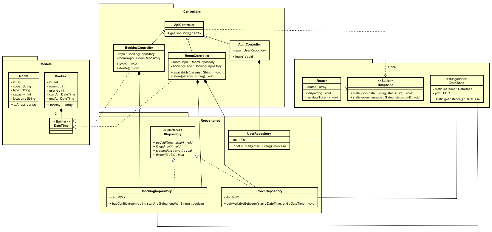

Este projeto é um sistema desenvolvido em PHP, estruturado com foco em boas práticas de programação e utilização de diversos padrões de projeto (Design Patterns).
O objetivo é demonstrar um fluxo organizado de execução, separação de responsabilidades e arquitetura limpa, facilitando manutenção, testes e evolução do sistema.

Ele também acompanha um Diagrama de Classes UML representando toda a estrutura do projeto.